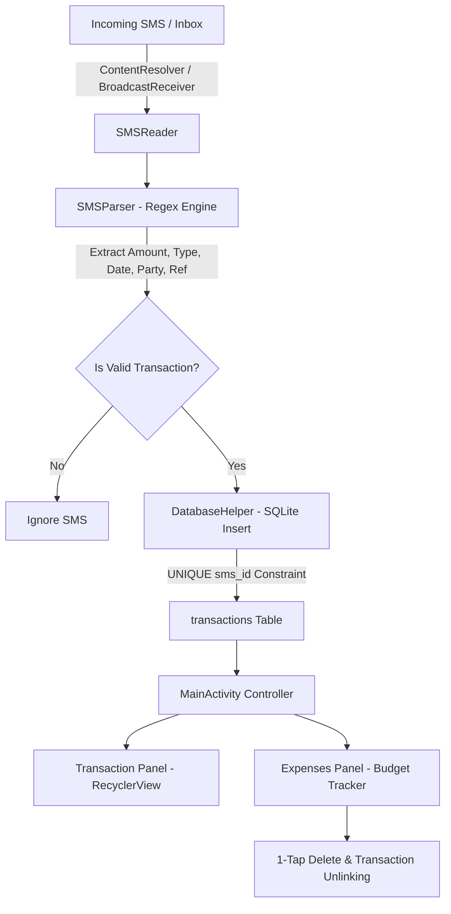

# 📱 SMS Expense Tracker & Budget Manager

An intelligent, privacy-first **Android Application** written in 100% Native Java and XML that **automatically transforms bank SMS notifications into an organized financial dashboard**, tracking spending habits, monthly category budgets, and net cash flow in real-time — completely offline without third-party server dependence.

---

## ⚡ Quick Download

Download and install the compiled Android application directly onto your physical Android device:

👉 **[⬇️ 1-Click Download Debug APK](file:///home/gaurang/Resume/SMS_Expense_Tracker/app/build/outputs/apk/debug/app-debug.apk)** 👈

---

## 📌 Executive Summary & Problem Solved

Managing personal finances often fails due to the friction of manual transaction entry. Modern users receive dozens of SMS notifications daily from banks and UPI apps (GPay, PhonePe, Paytm). **SMS Expense Tracker** eliminates manual data entry by running an on-device regex parsing engine over incoming and historical bank SMS messages. It extracts financial amounts, transaction types (credit vs. debit), merchant parties, and reference numbers, storing them securely in an on-device SQLite database.

---

## 🔄 System Architecture & Data Pipeline



---

## 🛠️ Complete Tech Stack & Architecture

| Layer | Technology / API | Purpose & Technical Highlight |
|-------|------------------|-------------------------------|
| **Language** | Native Java (JDK 17) | Core application architecture, OOP, memory management |
| **UI Design** | Android XML & Material Components | MaterialCardView, CoordinatorLayout, Custom Vector Drawables |
| **Database** | SQLite (`SQLiteOpenHelper`) | Relational database with automatic migration & transactional unlinking |
| **Concurrency** | `ExecutorService` & `Handler` | Asynchronous background SMS parsing without UI thread blocking |
| **OS Integration** | `ContentResolver` & `BroadcastReceiver` | Real-time SMS interception (`RECEIVE_SMS`) and inbox reading (`READ_SMS`) |
| **Parsing Engine** | Java Regular Expressions (`java.util.regex`) | Dynamic pattern extraction for multi-bank transaction SMS formats |
| **Monetization** | Google AdMob SDK v23.6.0 | Responsive banner ad integration managed with activity lifecycle |

---

## 🌟 Key Features & Capabilities

### 1. 🤖 Automatic Bank SMS Parsing
- **Historical Inbox Import**: Scans phone SMS inbox on initial launch using background worker threads.
- **Real-Time SMS Interception**: Automatically intercepts incoming SMS notifications via `SMSReceiver` broadcast receiver.
- **Multi-Bank Regex Patterns**: Supports major Indian banks (DNS Bank, HDFC, SBI, ICICI, Axis, Kotak) and UPI platforms (GPay, PhonePe, Paytm, BHIM).

### 2. 📊 Budget & Category Management
- **Custom Expense Categories**: Define monthly budgets for categories like *Food*, *Rent*, *Shopping*, *Utilities*.
- **Spent vs. Budget Metrics**: Calculates spending percentage, remaining budget balance, and dynamic color-coded progress bars (Green for safe, Red when budget exceeded).

### 3. 🗑️ 1-Tap Category Deletion & Unlinking
- **Instant Deletion**: Delete expense categories with a single tap on the trash icon (`btnDeleteExpense`).
- **Data Integrity**: Automatically resets linked transactions to uncategorized (`COL_EXPENSE_ID = -1`) and dynamically updates summary header totals (`tvTotalBudget` and `tvTotalSpent`).
- **Resilient Fallback**: Deletes records by Primary Key ID with automatic fallback to name matching.

### 4. ➕ Manual Cash Transaction Logging
- Add offline/cash expenses using an intuitive modal dialog (`AddTransactionDialog`) featuring native DatePicker & TimePicker support.

### 5. 🔒 100% Offline Privacy Guarantee
- All financial data is stored locally in SQLite (`sms_expenses.db`). Zero user data is uploaded to cloud servers or remote APIs.

---

## 📂 Comprehensive Project Directory Structure

```
SMSExpenseTracker/
├── app/
│   ├── build.gradle                             → Dependencies & SDK versions (Compile SDK 35, Min SDK 21)
│   └── src/main/
│       ├── AndroidManifest.xml                  → Permissions (READ_SMS, RECEIVE_SMS, INTERNET) & Receivers
│       ├── java/com/example/smsexpensetracker/
│       │   ├── MainActivity.java                → Tab container activity & main controller
│       │   ├── ExpenseActivity.java             → Standalone Expense category activity
│       │   ├── Transaction.java                 → Model representing single debit/credit transaction
│       │   ├── Expense.java                     → Model representing monthly budget category
│       │   ├── DatabaseHelper.java              → SQLite helper managing transactions & expenses tables
│       │   ├── SMSReader.java                   → Service querying ContentResolver content://sms/inbox
│       │   ├── SMSParser.java                   → Regex engine extracting structured financial data
│       │   ├── SMSReceiver.java                 → BroadcastReceiver catching real-time incoming SMS
│       │   ├── TransactionAdapter.java          → RecyclerView adapter rendering transaction rows
│       │   ├── ExpenseAdapter.java              → RecyclerView adapter with 1-tap delete listener
│       │   ├── TransactionDialog.java           → Detail & category assignment dialog
│       │   ├── AddTransactionDialog.java        → Dialog for manual transaction logging
│       │   └── AddExpenseDialog.java            → Dialog for creating new monthly budget categories
│       └── res/
│           ├── drawable/
│           │   ├── ic_delete.xml                → Red trash icon vector asset
│           │   └── bg_dialog_rounded.xml        → Rounded white background shape for dialogs
│           ├── layout/
│           │   ├── activity_main.xml            → Main screen layout with transaction & expense panels
│           │   ├── activity_expenses.xml        → Expenses overview layout
│           │   ├── item_transaction.xml         → Layout for individual transaction item
│           │   ├── item_expense.xml             → Layout for expense card with delete button
│           │   ├── dialog_transaction.xml       → Layout for transaction detail dialog
│           │   ├── dialog_add_transaction.xml   → Layout for adding cash transactions
│           │   └── dialog_add_expense.xml       → Layout for adding expense budgets
│           └── values/
│               ├── colors.xml                   → Primary, Accent, and status color tokens
│               ├── strings.xml                  → App string resources
│               └── themes.xml                   → Material design themes
├── build.gradle                                 → Project-level build script
├── gradle.properties                            → JVM args & AndroidX settings
├── gradlew / gradlew.bat                        → Executable Gradle wrapper scripts
└── README.md                                    → Comprehensive project documentation
```

---

## 🗄️ Database Architecture & Schema

The application utilizes an SQLite database named `sms_expenses.db` (Version 3) containing two relational tables:

### Table 1: `transactions`
| Column Name | Data Type | Constraint | Purpose |
|-------------|-----------|------------|---------|
| `id` | `INTEGER` | `PRIMARY KEY AUTOINCREMENT` | Unique transaction ID |
| `datetime` | `TEXT` | `NOT NULL` | Formatted date string (`dd-MM-yyyy HH:mm:ss`) |
| `amount` | `REAL` | `NOT NULL` | Monetary value in INR (₹) |
| `type` | `TEXT` | `NOT NULL` | `"Credited"` or `"Debited"` |
| `description` | `TEXT` | `NULLABLE` | User note or transaction memo |
| `party` | `TEXT` | `NULLABLE` | Sender / merchant name (e.g. `bharatpe@upi`) |
| `reference` | `TEXT` | `NULLABLE` | Bank UTR / Reference number |
| `sms_id` | `TEXT` | `UNIQUE` | Original SMS message ID (prevents duplicate entries) |
| `sms_date` | `INTEGER` | `DEFAULT 0` | Unix epoch timestamp used for sorting |
| `expense_id` | `INTEGER` | `DEFAULT -1` | Foreign Key linking to `expenses.id` (-1 = unassigned) |

### Table 2: `expenses`
| Column Name | Data Type | Constraint | Purpose |
|-------------|-----------|------------|---------|
| `id` | `INTEGER` | `PRIMARY KEY AUTOINCREMENT` | Unique expense category ID |
| `name` | `TEXT` | `UNIQUE` | Category title (e.g., "Food", "Rent") |
| `monthly_budget` | `REAL` | `NOT NULL` | Target monthly allocation (₹) |
| `spent_amount` | `REAL` | `DEFAULT 0` | Cumulative spent amount for category (₹) |
| `created_date` | `TEXT` | `NOT NULL` | Date category was established |

---

## 🧠 Regex Extraction Engine Rules

```java
// Amount Pattern Matching
Pattern amountPattern = Pattern.compile("(?:Rs|INR|₹)\\.?\\s*([\\d,]+\\.\\d{2}|[\\d,]+)", Pattern.CASE_INSENSITIVE);

// Merchant / VPA Pattern Matching
Pattern partyPattern = Pattern.compile("(?:to|at|info)\\s+([a-zA-Z0-9.\\-_]+@[a-zA-Z0-9]+)", Pattern.CASE_INSENSITIVE);

// Bank Reference Number Pattern
Pattern refPattern = Pattern.compile("(?:RefNo|Ref|UTR|Txn)\\s*[:#-]?\\s*([0-9]{8,16})", Pattern.CASE_INSENSITIVE);
```

---

## ⚙️ How to Build from Source

### Prerequisites
- **Android Studio** (Hedgehog 2023.1.1 or newer recommended)
- **Java Development Kit (JDK 17)**
- **Android SDK Platform 35**
- Physical Android phone running **Android 5.0 (API 21)** or higher (SMS permissions are restricted on emulators).

---

## ❓ Frequently Asked Questions & Troubleshooting

| Issue | Root Cause | Solution |
|-------|------------|----------|
| **No transactions visible on first launch** | SMS permissions not granted | Grant SMS permissions in phone **Settings → Apps → SMS Expense Tracker → Permissions**. |
| **Duplicate transactions showing** | Non-unique SMS IDs | Database automatically enforces `UNIQUE(sms_id)`. Tap 🔄 Reload to refresh SQLite cache. |
| **Category delete button not responding** | Focus interception in RecyclerView | Fixed in latest build by declaring `btnDeleteExpense` as `ImageView` with `focusable="false"`. |
| **Play Protect Warning when installing APK** | Sideloaded debug build signature | Tap **More details → Install anyway**. This is standard behavior for sideloaded development APKs. |

---

*Developed with Native Java, SQLite, and Material Components. 100% offline, privacy-first personal finance management.*
